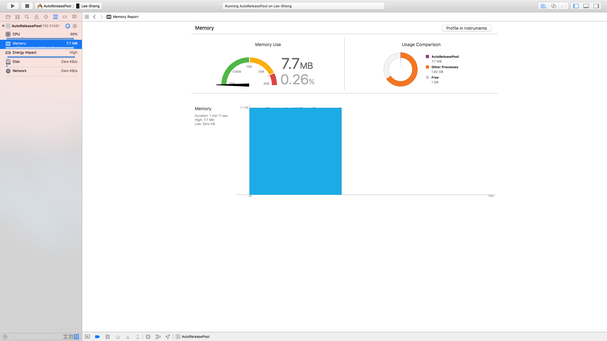
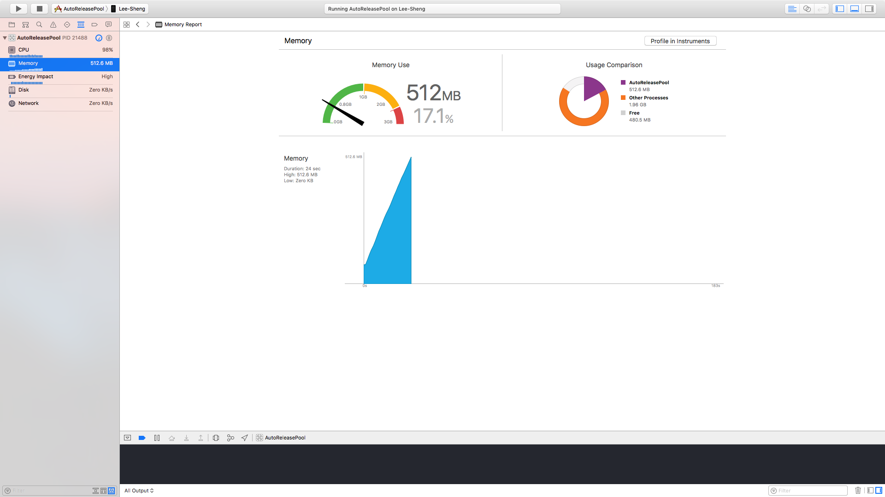

# Synopsis

Test the [Profiling](https://en.wikipedia.org/wiki/Profiling_(computer_programming)) process when load a image with or without **autoreleasepool**. 

# Result

> Test in iPhone7 Plus, OS 10.3.3

**With autoReleasePool**

**Without autoReleasePool**

# Reference

[Stack overflow](http://stackoverflow.com/questions/25860942/is-it-necessary-to-use-autoreleasepool-in-a-swift-program)

[Apple document](https://developer.apple.com/.../mmAutoreleasePools.html)
